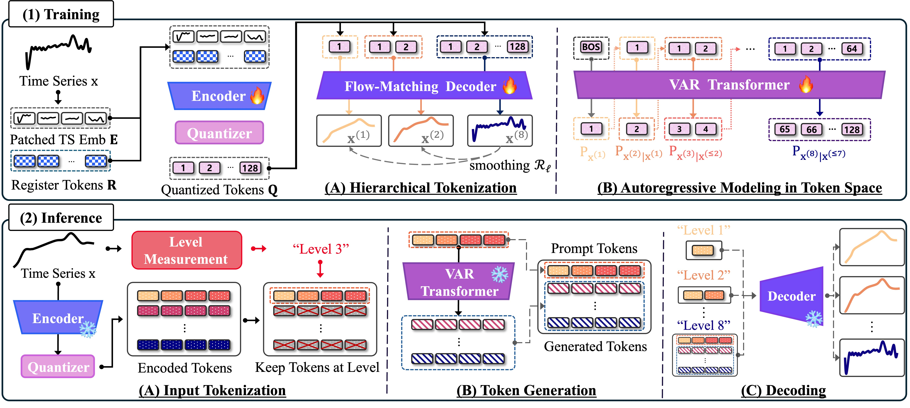
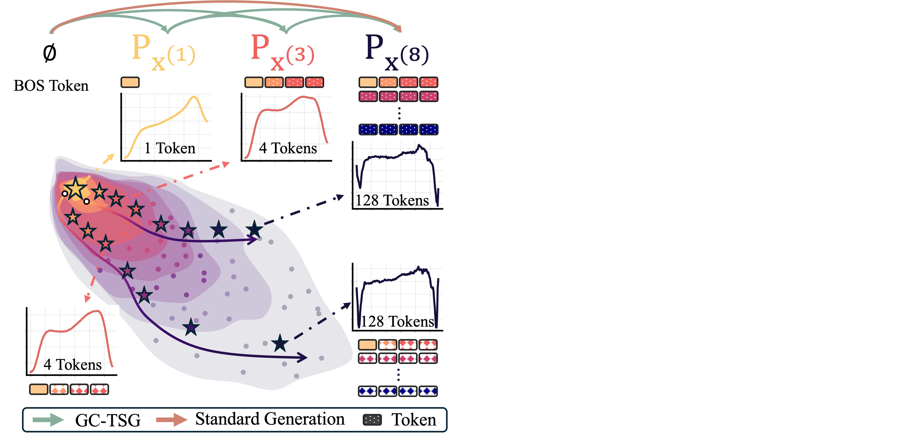
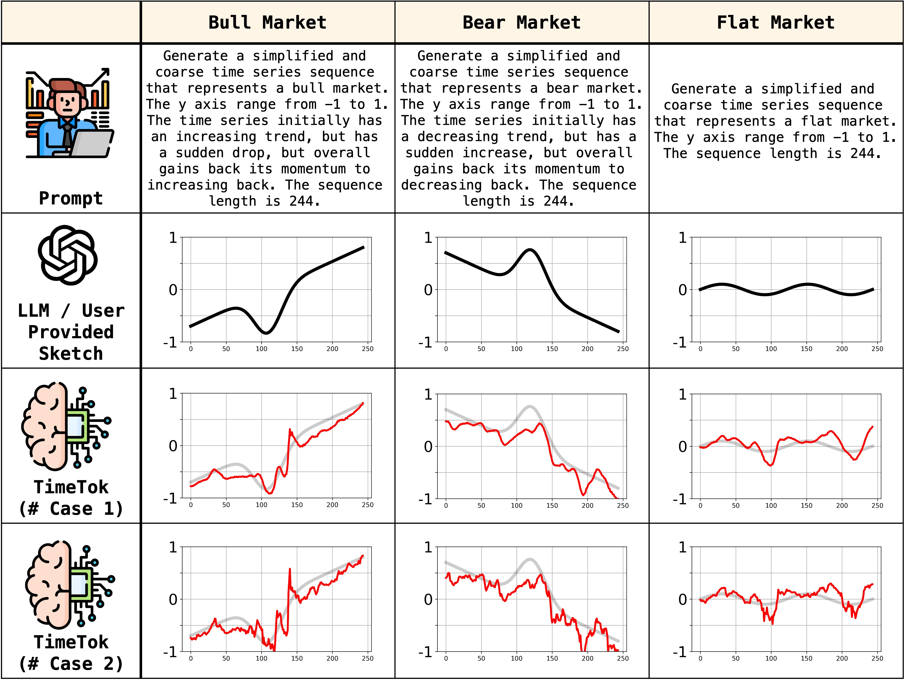

# `TimeTok`: Granularity-Controllable Time-Series Generation via Hierarchical Tokenization (NeurIPS'26)


## Explanation of Overview Figure

Overall scheme of `TimeTok`. **(1) Training:**  The hierarchical tokenizer is trained to encode input time series into a sequence of discrete tokens structured in a coarse-to-fine temporal hierarchy. These tokens are then used to train the VAR Transformer that autoregressively predicts tokens at the next granularity level. **(2) Inference:** A conditioning time series of unknown granularity is encoded into a full token sequence, from which tokens at the inferred granularity are selected as a prefix for the VAR Transformer to generate the remaining tokens. The completed token sequence is then decoded into a time series at the target granularity.

## Motivation



Illustration of Granularity Controlled Time-Series Generation (GC-TSG). $\mathbf{P}_{\mathbf{x}^{(i)}}$ denotes the time-series distribution at granularity level $i\in\{1,...,8\}$, ranging from coarsest i = 1 to the finest i = 8. GC-TSG generates time series from any granularity level $i$ to any finer level $j > i$, or from scratch. Standard generation, which generates the original data distribution from scratch, can be viewed as a special case of GC-TSG that generates from $\varnothing$ (e.g., `[BOS]` token) to level $j = 8$.

## Use Case



Complex time series are inherently difficult to describe using natural language due to their temporal structure and inherent randomness. In contrast, specifying a coarse outline of the time series is relatively straightforward: a user can simply draw the outline or ask an LLM to generate such signals or scenarios. This motivates an important application of TimeTok: generating fine-grained signals conditioned on a coarse outline. For instance, a financial analyst may want to model a bull market scenario, but with a slight drop in between. Such coarse outline can be easily provided with an LLM as shown in the bull market scenario in Figure. Using this coarse outline, the analyst can use TimeTok to generate realistic financial bear market movement at various granularity levels, conditioned on the signal. We note that such generation is grounded on the actual distribution of the stock market (i.e., TimeTok’s training data), differentiating with methods that simply add random noise to the coarse structure.

## GPU Info
- GPU: NVIDIA RTX A6000 (48GB)
- CUDA: 12.8
- Pytorch: 2.7.1
- Python: 3.10

## Environment Setup
```sh
conda create -n timetok python=3.10
conda activate timetok
pip install torch==2.7.1 torchvision==0.22.1 torchaudio==2.7.1 --index-url https://download.pytorch.org/whl/cu128
pip install -r requirements.txt
```

## Usage
### Step 1: Train Hierarchical Tokenizer

**Option A: Individual Dataset Tokenizer**
```bash
cd 00_Hierarchical_Tokenizer
python scripts/train_timetok.py --dataset ECG5000 --epochs 1000 --device cuda:0
```

**Option B: Foundation Tokenizer (UTSD)**
```bash
cd 00_Hierarchical_Tokenizer
python scripts/train_Foundation_timetok.py --dataset UTSD --epochs 50 --device cuda:0
```

Trained weights are saved to: `03_Shared/tokenizer_weights/{dataset}/`

### Step 1-1(optional): Visualize Tokenizer Results

Open and run the visualization notebook:
```
00_Hierarchical_Tokenizer/notebook/TimeTok_visualize.ipynb
```

### Step 1-2: Tokenize Time Series Data

Open and run the tokenization notebook:
```
00_Hierarchical_Tokenizer/notebook/01_Save_To_TokenSequence.ipynb
```
You need to run Step 1-2 to construct tokenized sequences needed to train the `01_AR_Training`.

Configure the following variables in the notebook:
- `TARGET_DATASET`: Dataset to tokenize (e.g., "ECG5000")
- `TOKENIZER_DATASET`: Which tokenizer to use (e.g., "ECG5000" or "UTSD")

Tokenized sequences are saved to: `03_Shared/tokenized_sequences/{tokenizer}_tokenizer/{dataset}_pz3/`

### Step 2: AR Transformer Training 
AR Transformer utilizes the tokens saved from `00_Hierarchical_Tokenizer` to train on the token sequences.

**Option A: VAR Trained with Individual Dataset Tokenizer tokenized sequence**
```bash
# The current example demonstrates training on ECG5000 Tokenized sequence
cd 01_AR_Training
sh scripts/run_individual_ECG5000.sh
```

**Option B: VAR Trained with Foundational Dataset Tokenizer tokenized sequence**
```bash
cd 01_AR_Training
sh scripts/run_foundational_ECG5000.sh
```

Running the above script will train the VAR model, and construct synthetic datasets for the target dataset (e.g., ECG5000).

Outputs of AR Training (synthetic tokens, synthetic time series) are saved to: `03_Shared/AR_outputs/{dataset}_pz3/EXP{EXP_NUM}/`
